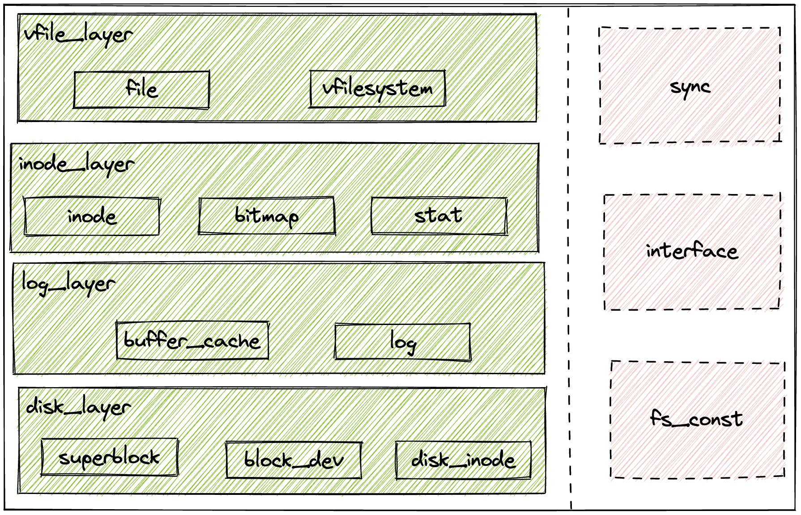

#  Capstone Project：基于模块化单内核操作系统的日志文件系统
## 自我介绍
我是张益程，此时是中国科学技术大学网络空间安全学院大四本科生，保研至中国科学技术大学先进数据系统实验室，研究兴趣是大规模存储系统、文件系统和图数据存储，将在李诚老师指导下完成我的研究生学业。

本项目是我的本科毕业设计，下列内容是本项目的整体介绍。
## 内容概要
本项目采用Rust语言参考 Xv6 Log-FS编写日志文件系统，随后将其接入到模块化单内核操作系统ArceOS中，根据文件系统的使用需求在Xv6 Log-FS的基础上进行功能拓展，最后参考pjdfstest书写若干测试用例并全部通过。
## 文档结构
[arceos](./arceos/): 包含ArceOS部分的代码、文件系统接入到其中的部分以及相关的测试代码

[xv6fs](./xv6fs/): 包含模块化实现的文件系统的代码，不能单独运行，需要实现对应的trait后文件系统才能运行

[xv6fs-fuse](./xv6fs-fuse/): 包含一个单独测试文件系统的代码文件，其中将一个大的文件视为文件系统的磁盘，该文件中用于单独测试文件系统的初始化程序和简单的文件与目录读写和日志功能的正确性。

[xv6-mkfs](./xv6-mkfs/): MIT最初的用C语言实现的磁盘镜像的生成代码

[xv6mkfs](./xv6mkfs/): 用Rust语言重写的磁盘镜像的生成代码

[docs](./docs/): 包含开题报告、中期报告、答辩报告和毕业论文对应的pdf和ppt文件

## 代码结构概要

文件系统加操作系统的整体结构如下图所示，紫色部分为文件系统功能调用路线，绿色部分为操作系统功能调用路线。具体内容见代码文件中的README和毕业论文中的介绍。

文件系统内部的结构如下图所示，左边为文件系统的功能实现模块，右边部分为文件系统与操作系统的接口层以及部分功能支持模块，具体介绍见[README](./xv6fs/README.md)和毕业论文系统设计章节文件系统部分

操作系统部分与文件系统相关部分的介绍见[fs.md](./arceos/fs.md)和毕业论文系统设计章节操作系统部分以及文件系统部分接口层和锁设计层。

## 学习与开发过程记录

本项目的开发过程中一部分内容记录在notion中，包含了前期参加rcore-os训练营时的学习内容，以及在毕设代码开发过程中的一些学习笔记。链接如下[笔记](https://silicon-aurora-0f5.notion.site/a176026d8b514658920b3709c8f1f1f3?v=7266118fc7264e5595f36ee8f007a496&pvs=4)

注：本项目开发与ArceOS支持虚拟文件系统之前，rustc版本为rustc 1.69.0-nightly，笔者目前正在将文件系统适配到最新的ArceOS上，并移植mdtest进行测试，测试完成后会更新当前仓库代码。
