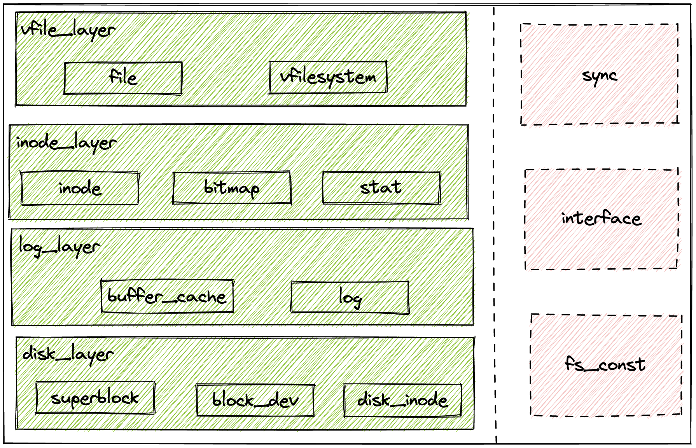

# 文件系统整体内容概括
具体代码分析见毕业论文，本文只介绍整体结构

文件系统部分整体结构如图所示



文件系统部分代码文件如下
```
.
├── bitmap.rs
├── block_dev.rs
├── buffer_cache.rs
├── disk_inode.rs
├── file.rs
├── fs_const.rs
├── inode.rs
├── interface.rs
├── lib.rs
├── log.rs
├── misc.rs
├── stat.rs
├── superblock.rs
├── sync
│   ├── mod.rs
│   ├── sleeplock.rs
│   └── up.rs
└── xv6fs.rs
```

文件系统整体分为左右两个部分

左侧为文件系统功能实现模块，分为磁盘层、日志层、inode层和虚拟文件层四层
+ 磁盘层负责磁盘的读写操作和磁盘数据的维护，涉及superblock.rs, disk_inode.rs和block_dev.rs三个文件
+ 日志层负责内存缓冲区和日志功能的维护，涉及buffer_cache.rs, log.rs两个文件  
+ inode层负责内存中inode节点的维护，负责实现了所有的文件系统调用的最基础的内容，以及bitmap的维护，涉及inode.rs, bitmap.rs和stat.rs三个文件
+ 虚拟文件层负责封装文件系统调用，同时提供文件系统的初始化程序，涉及file.rs和xv6fs.rs两个文件

右侧为文件系统功能支持模块，分为负责SleepLock维护的sync模块，维护文件系统常量的fs_const模块和负责与OS进行对接的interface模块，三者分别对应sync文件夹、fs_const.rs文件以及interface.rs文件。